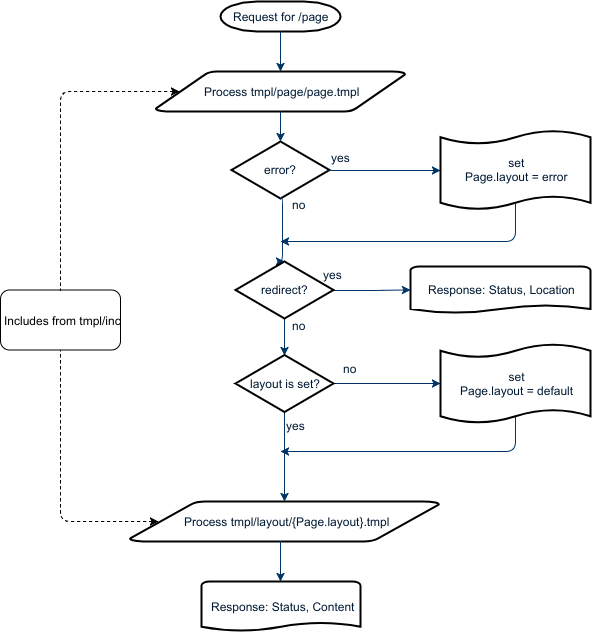

# mulate
> golang package for multiple layouts & templates processing by single handler

[![GoCard][gc1]][gc2]
 [![GitHub Release][gr1]][gr2]
 [![GitHub code size in bytes][sz]]()
 [![GitHub license][gl1]][gl2]

[gc1]: https://goreportcard.com/badge/apisite/mulate
[gc2]: https://goreportcard.com/report/github.com/apisite/mulate
[gr1]: https://img.shields.io/github/release/apisite/mulate.svg
[gr2]: https://github.com/apisite/mulate/releases
[sz]: https://img.shields.io/github/languages/code-size/apisite/mulate.svg
[gl1]: https://img.shields.io/github/license/apisite/mulate.svg
[gl2]: LICENSE

* Project status: MVP is ready
* Future plans: tests & docs

This package offers 2-step template processing, where page content template called first, so it can
1. change page layout (among them previous markup)
2. abort processing and return error page (this will go to way 1)
3. abort processing and return redirect

If page content template returns HTML, at step 2, layout template will be called for result page markup build.

## Request processing flow



## Template structure

According to [sample](sample/), site templates tree might looks like: 

```
tmpl
├── inc
│   ├── footer.tmpl
│   ├── head.tmpl
│   └── menu.tmpl
├── layout
│   ├── default.tmpl
│   ├── error.tmpl
│   └── wide.tmpl
└── page
    ├── admin
    │   └── index.tmpl
    ├── err.tmpl
    ├── index.tmpl
    ├── page.tmpl
    └── redir.tmpl

```

## Usage

```go

import "github.com/apisite/mulate"

func main() {

    mlt := mulate.New(cfg.Template)
    mlt.DisableCache(true)

    allFuncs := make(template.FuncMap, 0)

    err = mlt.LoadTemplates(allFuncs)

    for _, uri := range mlt.Pages() {
        log.Debugf("Registering uri: %s", uri)
        http.HandleFunc("/"+uri, handleHTML(mlt, uri, log))
    }
}  
```

### See also
* [sample](sample/)
* [gin-mulate](https://github.com/apisite/gin-mulate) - [gin](https://github.com/gin-gonic/gin) bindings for this package

### Template methods
Get http.Request data
```
{{ .Request.Host }}{{ .Request.URL.String }}
```
Get query params
```
{{ $param := .Request.URL.Query.Get "param" -}}
```
Set page title
```
{{ .SetTitle "admin:index" -}}
```
Choose layout
```
{{ .SetLayout "wide" -}}
```
Stop template processing and raise error
```
{{ .Raise 403 "Test error" "Error description" true }}
```
Stop template processing and return redirect 
```
{{ .RedirectFound "/page" }}
```

### Custom methods
in code
```go
reqFuncs["data"] = func() interface{} {
    return data
}
p, err := mlt.RenderPage(uri, reqFuncs, r)
```
in templates
```
{{range data.Todos -}}
    <li>{{- .Title }}
{{end -}}

```
## TODO

* [ ] docs, part 1
* [ ] tests, part 1
* [ ] google and ask reddit for analogs
* [ ] tests, part 2
* [ ] docs, part 2
* [ ] release

## Library name

**mulate** means **mu**ltiple **la**youts & **te**mplates.

## License

The MIT License (MIT), see [LICENSE](LICENSE).

Copyright (c) 2018 Aleksei Kovrizhkin <lekovr+apisite@gmail.com>

